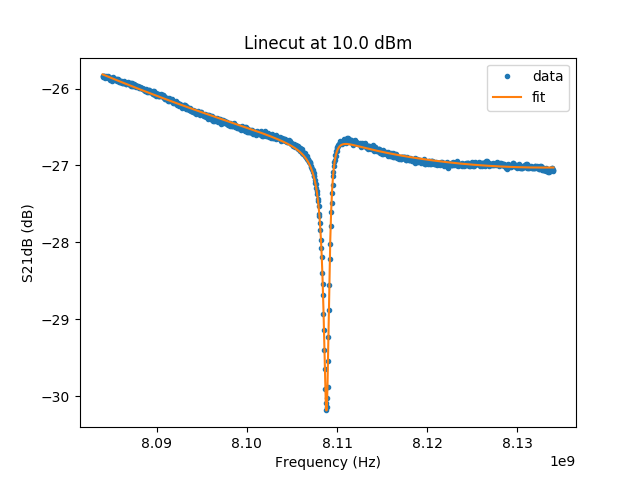

Example for S11fit
====================

Example for fitting RF spectroscopy.

There are various options available for S11fit.

   Data and fit for :code:`M59_2017_06_26_16.58.40_RF_vs_power_m60dbmatt_2amp_ref_sample.dat`.

.. literalinclude:: ../../examples/example_S11fit.py
  :language: python

.. .. automodule:: ../../examples/example_S11fit.py
..   :members: