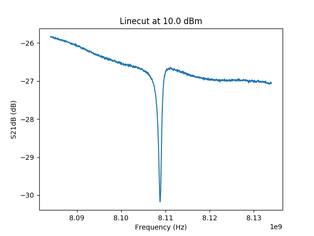
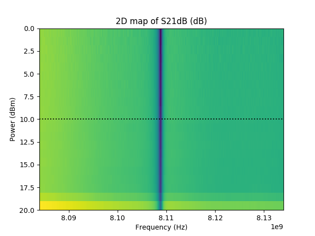

Example for readdata
====================

Example for loading and saving data

There are various options available for dataprocessing for mymtx.
The advantage over autoplot doing it this way is that you have the actual data at your hands,
if you wish to do data processing. For only displaying the data, stlabutils.autoplot is the
preferred option.

   Linecut of :code:`M59_2017_06_26_16.58.40_RF_vs_power_m60dbmatt_2amp_ref_sample.dat`.

   2D map of :code:`M59_2017_06_26_16.58.40_RF_vs_power_m60dbmatt_2amp_ref_sample.dat`.

.. literalinclude:: ../../examples/example_readdata.py
  :language: python